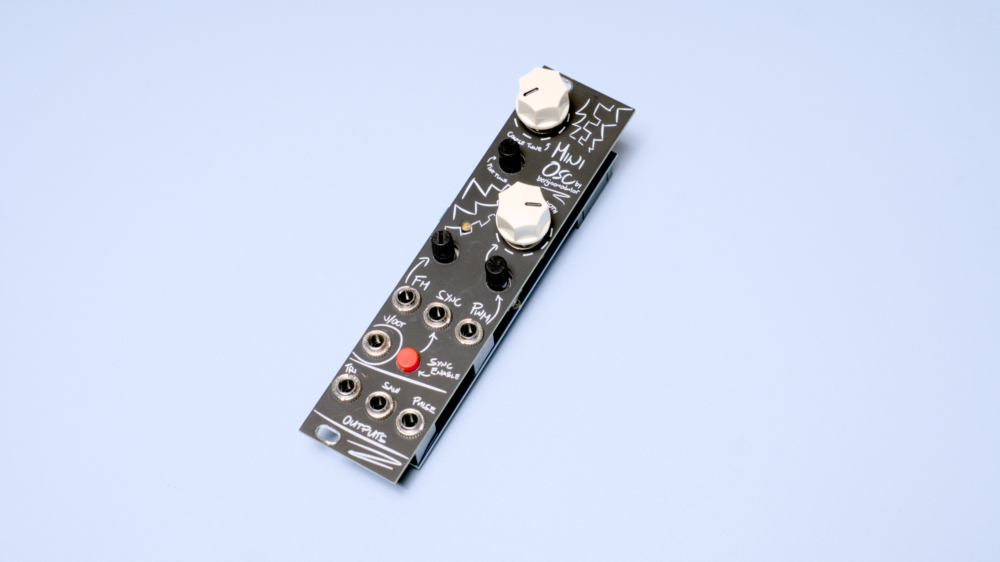

# MiniOSC
[![CC BY-SA 4.0][cc-by-sa-shield]][cc-by-sa]

## Schematics
**Version 2.1**

More info on my website: 

## Old versions

**Version 1.1**

More info on my website: https://benjiaomodular.com/post/2021-12-03-volt-per-octave-40106-vco/

## License

This work is licensed under a
[Creative Commons Attribution-ShareAlike 4.0 International License][cc-by-sa].

[![CC BY-SA 4.0][cc-by-sa-image]][cc-by-sa]

[cc-by-sa]: http://creativecommons.org/licenses/by-sa/4.0/
[cc-by-sa-image]: https://licensebuttons.net/l/by-sa/4.0/88x31.png
[cc-by-sa-shield]: https://img.shields.io/badge/License-CC%20BY--SA%204.0-lightgrey.svg